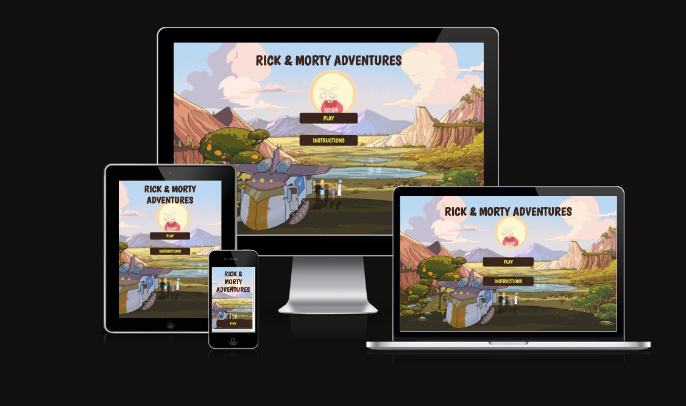
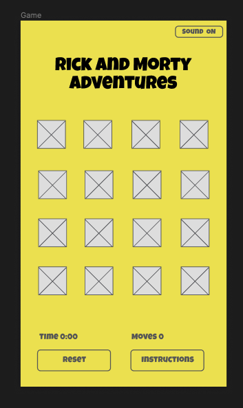
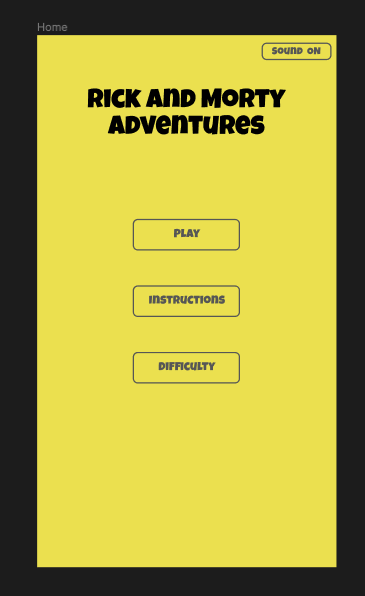
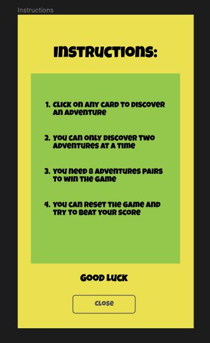

# Rick & Morty Adventures

Vie live site here: [Rick & Morty Adventures](https://sorinpan.github.io/rick_morty-adventures/)

Rick & Morty Adventures is a simple memory card game based on the Rick and Morty tv show. The application is for users of all ages that want to enjoy a classic memory card game.

---

## Contents

---

## User Experience (UX)

### User Stories

#### First Time Visitor Goals

#### Returning Visitor Goals

#### Frequent Visitor Goals

## Design

### Colour Scheme

### Typography

### Imagery

### Wireframes

## Features

### Accessibility

## Technologies Used

### Languages

### Frameworks, Libraries & Programs

## Deployment & Local Development

### Deployment

### Local Development

## Testing

## Credits

