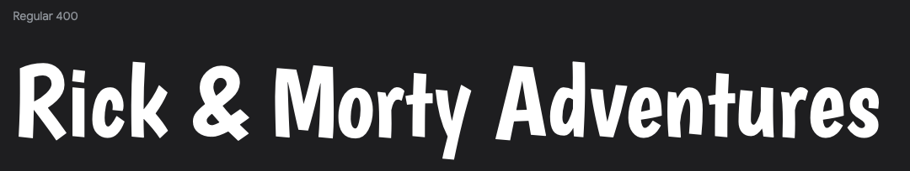
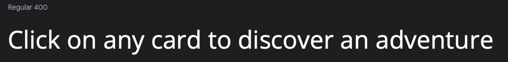

# Rick & Morty Adventures

Vie live site here: [Rick & Morty Adventures](https://sorinpan.github.io/rick_morty-adventures/)

Rick & Morty Adventures is a simple memory card game based on the Rick and Morty tv show. The application is for users of all ages that want to enjoy a classic memory card game.

---

## Contents

---

## User Experience (UX)

### User Stories

#### First Time Visitor Goals

* As a first time user I want to quickly understand what the application is about.
* As a first time user I want to get clear instructions on how to play the game and what the rules are.
* As a first time user I want the easily navigate the site and start a game.

#### Returning Visitor Goals

* As a returning user I want to have an enjoyable experience while playing the game.
* As a returning user I want to be able to see and achieve a better score.

#### Frequent Visitor Goals

* As a frequent user I want to be able to master the game.

## Design

### Colour Scheme

As the theme of the game is the tv-show Rick and Morty, I tried to use the colors that tipically appear on the show. I used the images of Rick and Morty to be able to create a palette. 

Bistre, Maize and Amaranth Pink fits perfectly with the background image and gives a vibe of the actual tv-show.

### Typography

Google Fonts was used to import the following fonts:

* The font Boogaloo was used for the titles and the majority of content. I think it has a playful appearance and fits perfectly with the theme of the game.

* The font Open Sans was used mainly in the instructions section. I think the font gives the site balance.

### Imagery

As the site has a specific theme, I used images from the Rick and Morty tv-show. I chose a background that displays the characters in the shows and for the flipcards I chose to have different characters. 

### Wireframes

## Features

### Home Page

* The home page is simple and intuitive. It display the site title and two buttons. 
* The Play button will first display a prompt that encourages the users to input their names. After the name input, the game board will display.
* The Instructions button will display a pop-up with the rules of the game.

### Instructions

* The instructions feature display the rules of the game.
* Helps the user to understand how the game is played.
* Contains a Close button so the user can go back to the home page.

### Game Board

* The user now sees all the cards face down. The Timer will start once the user clicks on any card to flip it.
* Contains a Restart button so the user can restart the game at any moment.

### End Game

* A pop-up message that appears once the users find all the card pairs.
* It informs the users that they won the game and displayes the score.
* Contains a Restart button so the users can restart the game again and beat the last score.

### Accessibility

## Technologies Used

### Languages

* HTML
* CSS
* JavaScript

### Frameworks, Libraries & Programs

* [Figma](https://www.figma.com) - Used for wireframes
* [Google Fonts](https://fonts.google.com) - Used to import fonts
* [VS Code](https://code.visualstudio.com) - Used to develop the website
* [Git](https://git-scm.com) - Used for version control
* [GitHub](https://github.com) - Used to store files and deploy
* [Google Developer Tools](https://developer.chrome.com/docs/) - Used for troubleshooting, test features and styling
* [FireFox Developer Edition](https://www.mozilla.org/en-US/firefox/developer/) - Used for troubleshooting, test features and styling
* [Am I Responsive](https://ui.dev/amiresponsive) - Used to show the websites responsiveness on different devices.
* [MDN Web Docs](https://developer.mozilla.org/en-US/docs/Web) - Used for learning

## Deployment & Local Development

### Deployment

I used GitHub pages to deploy the website:

1. Log in to GitHub.
2. Select the project's repository.
3. Go to "Settings".
4. Click on "Pages".
5. In the Source section, select branch "Main" and then select "Root" from the dropdown menu.
6. Click "Save".
7. Wait a couple of seconds and GitHub will provide the link to deployed website.

### Local Development

- Log in to [Github](https://github.com/).
- Select project [Repository](https://github.com/SorinPan/tuner-nation).
- Click on the "Code" button.
- Copy the URL under HTTPS.
- Open VsCode.
- Log in to VsCode with your Github account.
- Press SHIFT + CMD + P (For Mac), type "Clone" and select "Git:Clone".
- Paste in the URL and press Enter to create the local clone.

## Testing

## Credits

